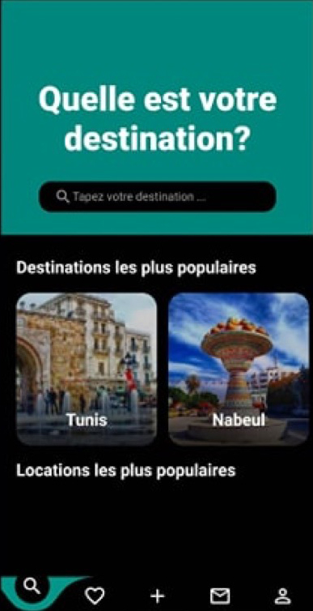
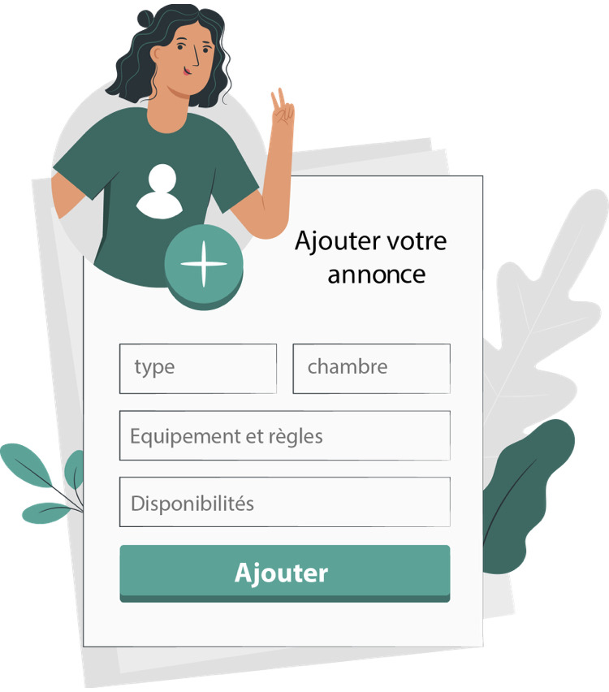

### Video Promotion of Final UI

Ekry.tn is a revolutionary mobile application designed to streamline the rental housing experience for individuals and investors in rental real estate. Exclusively available in Tunisia, this powerful platform is built with Flutter for Android and iOS, and utilizes Firebase for seamless backend operations. With its modern design and Dark mode functionality, Ekry.tn offers a visually stunning and user-friendly interface with responsive layouts that enhances the overall user experience.

One of the standout features of Ekry.tn is its support for multiple languages, including Arabic, French, and English, with the ability to add additional languages. This ensures that users can comfortably interact with the app in their preferred language, promoting inclusivity and accessibility.

Incorporating the innovative 'blurhash' technology, Ekry.tn introduces a new approach to image loading. Instead of waiting for the complete image to load, 'blurhash' displays a flowing preview that gradually transforms into the final image, depending on your internet connection. This technology provides users with a visually pleasing experience while browsing property listings.

The core functionality of Ekry.tn revolves around direct communication between tenants and property owners. By simply adding their apartment listings, owners can connect with potential tenants through the app's built-in chat feature. This direct line of communication eliminates unnecessary intermediaries, ensuring efficient and personalized interactions.

Ensuring the authenticity and reliability of property listings, Ekry.tn employs machine learning algorithms powered by Firebase for simple verification. This process adds an extra layer of trust, safeguarding users from fraudulent or misleading listings.

With the integration of Google Maps, Ekry.tn enables clients to easily verify the location of properties. Users can view properties on an interactive map, assess the surrounding area, and make informed decisions about their preferred neighborhood.

Whether you are searching for your dream rental home or seeking to optimize your rental property investments, Ekry.tn is your go-to application in Tunisia. Experience the convenience of modern design, Dark mode functionality, multi-language support, direct owner communication, and location verification through Google Maps. Simplify your rental journey and join the growing Ekry.tn community today.

## Photos

